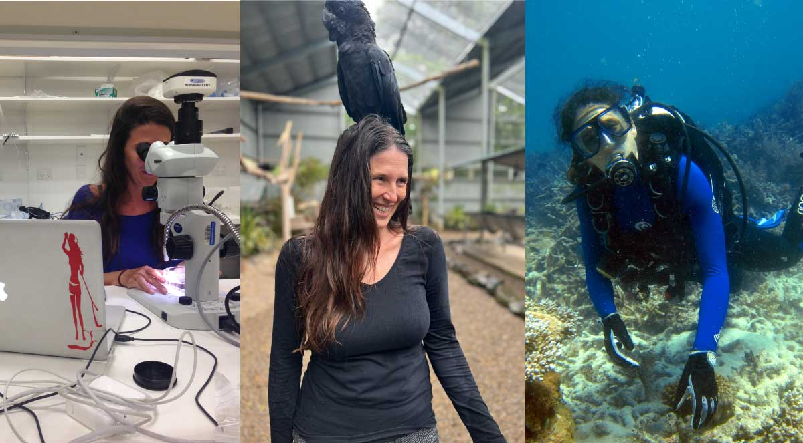

```{r setup, include=FALSE}
knitr::opts_chunk$set(echo = TRUE)
```

<style>
  h1.title {
    display: none;
  }
  .left-align {
    float: left;
    margin-right: 40px; 
    margin-bottom: 0px; 
  }
  .right-align {
    float: right;
    margin-left: 20px; 
  }
  .main-container {
    max-width: 800px; /* Adjust the width as needed */
    margin: 0 auto;   /* Center the content */
  }
</style>

### Project lead, symbioBase curator
#### - Eugenia Sampayo (PI, symbioBase curator)

<br>

::: {class="right-align"}

:::

Eugenia is a Research Fellow at the University of Queensland She completed her PhD in 2008 at the University of Queensland, after which she worked in the USA and Japan before returning to the Australia in 2012. Eugenia’s research focuses on the ecology and functional significance of the symbiotic dinoflagellates (Symbiodinium) that associate with many marine invertebrates, including scleractinian corals. She is particularly interested symbioses ecology and evolution, species ranges and flexibility of symbiotic partnerships in the context of climate change. 

As an [ABRS NTRGP](https://www.dcceew.gov.au/science-research/abrs/grants), Eugenia is responsible for curation and taxonomic revision to Australian Symbiodiniaceae via Symbiobase. Through the extensive sample collection of high-latitude reefs, this research has led to the discovery of 17 new Cladocopium genotypes (Sampayo in prep).


<br>
<br>


### Symbiobase collaborators:


#### - Todd C. LaJeunesse (Pennsylvania State University, USA)

::: {class="left-align"}

:::

Research in the [Symbiosis & Evolution lab](https://symbiosisecoevo.weebly.com/people.html) focuses on the evolutionary ecology of mutualistic symbioses, mainly coral-dinoflagellate associations. Through the use of various genetic-based approaches in laboratory and field settings we examine ecological, biogeographic, and phylogenetic patterns in order to deduce fundamental ecological and evolutionary processes involving microbial eukaryotes. The symbionts of corals, Symbiodinium, are ideal for examining broader questions about microbial eukaryotic biodiversity, clonality, sexual recombination, dispersal, speciation, and ecological/physiological specialization, among other topics.

<br>

<br>

#### - Zoe Richards (Curtin University / Western Australian Museum, Australia)

::: {class="left-align"}

:::


[Zoe](https://staffportal.curtin.edu.au/staff/profile/view/zoe-richards-e072e458/) is a scleractinian coral taxonomist whose research revolves around coral biodiversity and how best to monitor and protect it. She is the leader of the Coral Conservation and Reserach Group (CORE) within the Trace and Enivronmental DNA Laboratory (TrAcE). Working in the areas of taxonomy, systematics, phylogenetics, population genetics, ecology and conservation biology, Zoe has conducted research on coral reefs across the globe for almost 20 years. Zoe currently holds a joint appointment with the Western Australian Museum where she holds the position of Marine Invertebrate Curator.


<br>
<br>


#### - Christian Voolstra (University of Konstanz, Germany)

::: {class="left-align"}

:::

Christian is a biologist and his research area is environmental genomics with a focus on acclimation and adaptation of marine invertebrates. In particular, Dr. Voolstra studies coral metaorganism function combining ecological, environmental, microbial, and molecular approaches. His most recent research has particularly advanced knowledge of how the bacterial microbiome contributes to coral animal host acclimation and adaptation.

<br>
<br>


#### - Lisa Kirkendale (Western Australian Museum, Australia)

::: {class="left-align"}

:::

Lisa is the Head of Aquatic Zoology and Curator of Molluscs at the Western Australian Museum. She is interested in the evolution, biogeography, phylogenetics and diversity of molluscs. Her work includes researching the largest giant clams to the smallest omalogyrid. 

<br>
<br>
<br>
<br>


#### - Ben Hume (CS Genetics)

::: {class="left-align"}

:::

Ben is a senior manager in computational biology and the lead developer of the SymPortal framwworkfor coral algal symbiont next-generation sequencing ITS2 profiling ([link](https://github.com/reefgenomics/SymPortal_framework)).

<br>
<br>


