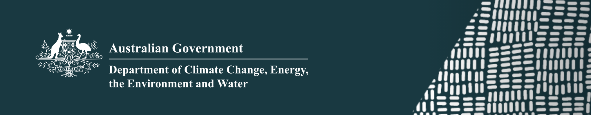

```{r setup, include=FALSE}
knitr::opts_chunk$set(echo = TRUE)
```
<br>
<br>

::: {style="float: right; width: 249px;"}

<br>

:::

### SymbioBase Support:

The [Australian Biological Resources Study](https://www.dcceew.gov.au/science-research/abrs/grants) (ABRS) National Taxonomy Research Grant Program (***NTRGP***) Postdoctoral Fellowship:

**Principal Investigator:** E. Sampayo\
**Joint Investigators:** S. Kim; C. SRiginos; J. SPandolfi\
**Institution**: The University of Queensland

**Project Title**: "Systematic and taxonomic analyses of eastern Australian Symbiodiniaceae: the unification of research on coral-algal mutualisms"\
**Project Length**: 2020-2024\
**Project synopsis:** Mutualisms between reef corals and single-celled dinoflagellates (family Symbiodiniaceae) have persisted for millions of years, creating modern-day productive coral reef ecosystems. Under accelerating climate change the future of coral ecosystems relies on coral adaptability, which tightly linked to resident symbiont species.  Despite the importance of Symbiodiniaceae in maintaining coral health, research progress is challenged by taxonomic resources, with few of the likely hundreds of species formally described.  With access to a large sample collection of eastern Australian coral specimens, this project examines the status of eastern Australian Symbiodiniaceae, develops a cost-effective genetic toolkit for species delineation and works towards the establishment of a molecular-taxonomic key and portal for ecological information.


### High-latitude symbiodinium

The [Winifred Violet Scott Charitable Trust](https://ror.org/01b1wzf66)

**Principal Investigator:** E. Sampayo\
**Institution**: The University of Queensland

**Project Title**: "Discovering hidden symbiont species diversity in tropical and subtropical corals"\
**Project Length**: 2024-2025\
**Project synopsis:** The importance of Symbiodiniaceae to coral reef health is undeniable and the aim is to establish a core foundation for the recognition of Symbiodiniaceae species and biodiversity. The Trust provides essential support to ensure continuity of developing resources, evaluation of the taxonomic status of subtropical symbiont species and the retention of experts in the field.


**Principal Investigator:** E. Sampayo\
**Joint Investigators:** M. Mello-Athayde\
**Institution**: The University of Queensland

**Project Title**: "Discovering hidden symbiont species diversity in tropical and subtropical corals"\
**Project Length**: 2023-2024\
**Project synopsis:** Considerable data describes the biodiversity of corals across tropical, subtropical and temperate regions of the Australian seaboard, yet equivalent data for their resident symbionts (Symbiodiniaceae) remains limited.  Effective conservation strategies of subtropical communities, formed by species uniquely adapted to living under harsh and fluctuating environments, is first and foremost defined by establishing which species are present at these locations.  The project examines species diversity of subtropical Symbiodiniaceae from ~ 2,000 coral specimens from 25 locations and supports conservation by identifying areas with high biodiversity and/or local endemics.
