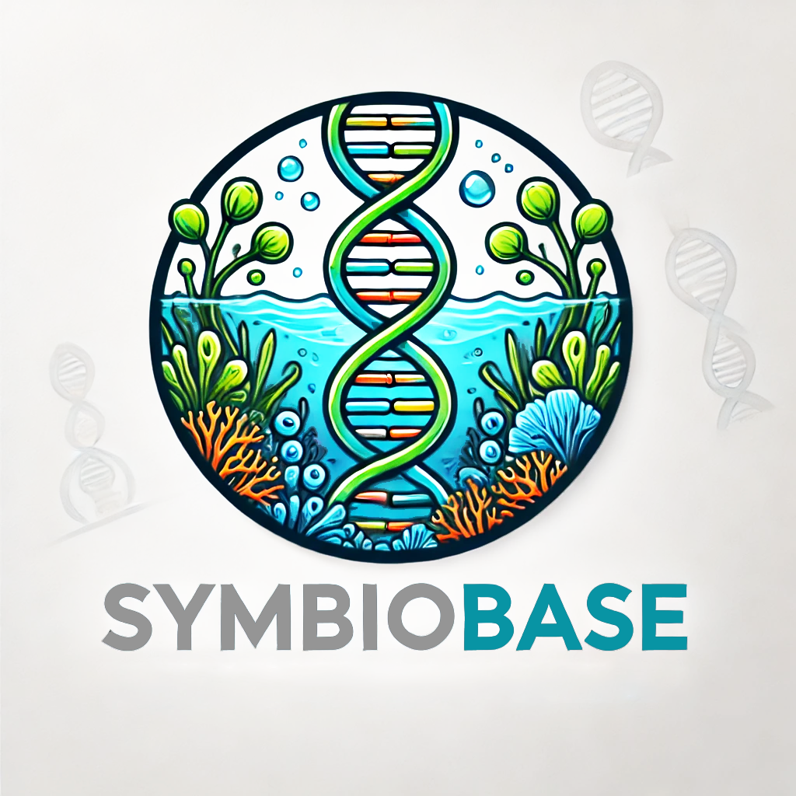

```{r setup, include=FALSE}
knitr::opts_chunk$set(echo = TRUE)
```

<style>
  h1.title {
    display: none;
  }
  .center-align {
    text-align: center;
    white-space: normal;  /* Use normal instead of wrap */
  }
</style>

### Symbiobase: a molecular-taxonomic key and database for Symbiodiniaceae

::: {class="center-align"}

:::

Symbiobase represents a taxonomic framework and revision for Symbiodiniaceae from the eastern Australian coast. Through ongoing updates, Symbiobase will act as a central portal for providing a molecular-taxonomic key and database. Symbiobase is formed from a collection of >4000 samples, spanning 20 degrees of latitude from the tropical northern Great Barrier Reef to the subtropical reefs of northern New South Wales, encompassing 12 taxonomic orders of marine invertebrates across 52 families, with a core focus on Scleractinia:

```{r, fig.width=10, fig.height=4, warning=FALSE, message=FALSE, cache=TRUE}


library(tidyverse)
library(lubridate)
library(ggplot2)
library(plotly)
library(patchwork)

order <- read.csv("https://raw.githubusercontent.com/symbiobase/symbioID/main/Symbiobase.csv") |>
  dplyr::select(host_order) |> 
  drop_na(host_order) |> 
  group_by(host_order) |> 
  summarise(count=n()) |> 
  ggplot() + theme_void() +
  ggtitle("Order") + ylab("") + xlab("") +
  geom_bar(aes(x="", y=count, fill=host_order), linewidth=0.1, color="black", stat="identity", width=1) +
  coord_polar("y", start=0) +
  #geom_text(data=data_pie_latitude, aes(x="", y=count, label = count), size=6, position = position_stack(vjust = 0.5)) +
  scale_fill_manual(values = colorRampPalette(RColorBrewer::brewer.pal(13, "RdBu"))(13)) +
  theme(plot.title = element_text(size=6), legend.text = element_text(size=6), legend.key.size = unit(0.5, "cm"), legend.title=element_blank())

family <- read.csv("https://raw.githubusercontent.com/symbiobase/symbioID/main/Symbiobase.csv")  |>
  dplyr::select(host_family) |> 
  drop_na(host_family) |> 
  group_by(host_family) |> 
  summarise(count=n()) |> 
  ggplot() + theme_void() +
  ggtitle("Family") + ylab("") + xlab("") +
  geom_bar(aes(x="", y=count, fill=host_family), linewidth=0.1, color="black", stat="identity", width=1) +
  coord_polar("y", start=0) +
  scale_fill_manual(values = colorRampPalette(RColorBrewer::brewer.pal(12, "Set1"))(53)) +
  theme(plot.title = element_text(size=6), legend.text = element_text(size=5), legend.title=element_blank(), legend.key.size = unit(0.5, "cm") ) +
  guides(fill = guide_legend(ncol = 4))


order + family + plot_annotation(title='Symbiobase collection of Symbiodiniaceae by host taxonomy') & 
  theme(plot.title = element_text(size = 10))

```

### Taxonomic framework for Symbiodinium

Symbiobase will provide an open access, streamlined species identification key to unify the taxonomy of Symbiodiniaceae via access to a curated sample database and associated ITS2 rDNA repeats.  

Our extensive sample collection of high-latitude reefs extends south to the worlds southernmost coral reef, Lord Howe Island, and has led to the discovery of 17 new Cladocopium genotypes (Sampayo in prep).   


```{r, fig.width=10, fig.height=4, warning=FALSE, message=FALSE, cache=TRUE}


library(tidyverse)
library(lubridate)
library(ggplot2)
library(plotly)
library(patchwork)


library(dplyr)
library(tidyr)
library(ggplot2)
library(stringr)
library(RColorBrewer)

symbio_pie <- read.csv("https://raw.githubusercontent.com/symbiobase/symbioID/main/Symbiobase.csv") |>
  select(sym_type_1, sym_type_2, sym_type_3) %>%
  pivot_longer(cols = everything(), names_to = "variable", values_to = "combined") %>%
  mutate(combined = if_else(str_length(combined) <= 6, combined, NA_character_)) %>%
  filter(!is.na(combined)) |> 
  filter(!combined %in% c("rerun", "mix?")) |> 
  group_by(combined) |> 
  summarise(count=n()) |>
  ggplot() + theme_void() +
  ggtitle("Resolved sequences") + 
  ylab("") + xlab("") +
  geom_bar(aes(x="", y=count, fill=combined), linewidth=0.1, color="black", stat="identity", width=1) +
  coord_polar("y", start=0) +
  scale_fill_manual(values = colorRampPalette(RColorBrewer::brewer.pal(12, "Paired"))(79)) +
  theme(plot.title = element_text(size=4), legend.text = element_text(size=6), legend.key.size = unit(0.35, "cm"), legend.title=element_blank())


symbio_chart <- read.csv("https://raw.githubusercontent.com/symbiobase/symbioID/main/Symbiobase.csv") %>%
  select(sym_type_1, sym_type_2, sym_type_3) %>%
  pivot_longer(cols = everything(), names_to = "variable", values_to = "combined") %>%
  mutate(combined = if_else(str_length(combined) <= 6, combined, NA_character_)) %>%
  filter(!is.na(combined)) %>%
  group_by(combined) %>%
  summarise(count = n()) %>%
  arrange(desc(count)) %>%
  slice_head(n = 10) %>%
  arrange(combined) %>%
  ggplot() +  theme_bw() +
  ggtitle("Top 10 most abundant sequence ID") + 
  ylab(" ") +  xlab("") + 
  geom_bar(aes(x = combined, y = count, fill = combined), linewidth = 0.1, show.legend=FALSE,
           color = "black", stat = "identity", width = 1) +
  scale_fill_manual(values = colorRampPalette(RColorBrewer::brewer.pal(12, "Paired"))(10)) + 
  theme(
    plot.title = element_text(size = 4),
    legend.text = element_text(size = 4),
    legend.title = element_blank(),
    axis.text.x = element_text(angle = 45, hjust = 1)
  ) 

symbio_pie + symbio_chart + plot_annotation(title='Symbiobase collection of Symbiodiniaceae by sequence ID') & 
  theme(plot.title = element_text(size = 11))

```

### Conservation
As Symbiodiniaceae are critical in the survival of reef building corals, there has been much interest into the environmental limits of symbionts. Certain genotypes are thermally tolerant and have been targeted in conservation models to identify locations with thermally tolerant coral populations under future climate conditions. Symbionts also represent a potential source of rapid adaptive change as rearrangements of partnerships over generations may lead to a modification in environmental stress tolerance. The current taxonomic uncertainty and lack of information on species distributions undermines the accuracy of i) model predictions aiming to understand species tolerance limits and ii) estimating the extent of community changes to tropical and high latitude coral communities that may act as climate refugia. Changes in regional and local symbiont species composition are expected to have downstream impacts on their coral hosts, influencing their thermal tolerance and thereby the capacity of tropical corals to inhabit subtropical refugia and subtropical corals to survive locally as oceans warm.
